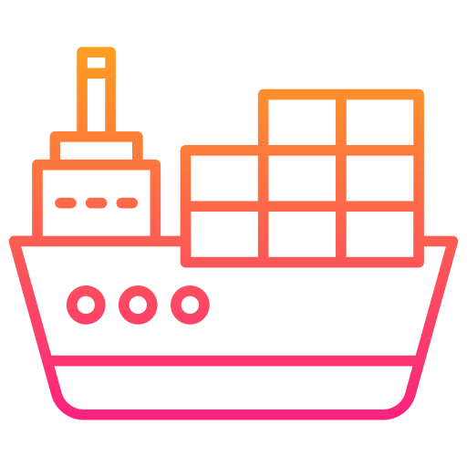

# Cargo


> [!NOTE]
> Cargo คือ build system และ package manager สำหรับภาษา Rust (เปรียบเสมือนกับ NPM ของ
> NodeJS)



## Cargo Commands

```bash
# --------- ที่ต้องรู้ ---------
cargo new <project_name>      # สร้างโปรเจ็คใหม่
cargo init <project_name>     # คล้ายกับ cargo new แต่สามารถสร้างโปรเจ็คจากโฟลเดอร์ที่มีอยู่ได้ เช่น cargo init .
cargo build                   # build project เป็น executable file ใน debug mode (ใช้สำหรับ development)
cargo build --release         # build project เป็น executable file ใน release mode (ใช้สำหรับ production)
cargo run                     # build & run project ใน debug mode
cargo run --release           # build & run project ใน release mode
cargo add <crate_name>        # เพิ่ม dependency ให้กับโปรเจ็ค (เหมือน yarn add <package_name>)
cargo add --dev <crate_name>  # เพิ่ม dev dependency ให้กับโปรเจ็ค
cargo update                  # อัปเดต dependency ทั้งหมดในโปรเจ็ค (ยึดตาม semver ที่กำหนดไว้ใน Cargo.toml)
cargo install <crate_name>    # ติดตั้ง crate แบบ global (เหมือน npm install -g <package_name>)
                              # ส่วนมากจะเป็น plugin ของ cargo

# --------- ที่มีประโยชน์ ---------
cargo check                # ใช้ run linter สำหรับตรวจสอบโปรเจ็ค (เบื้องต้น)
cargo clippy               # เหมือน cargo check แต่ Advanced กว่า สามารถตรวจสอบโปรเจ็คที่มีข้อผิดพลาดที่ซับซ้อนกว่าได้
                           # รวมถึงให้คำแนะนำแนวทางเขียนโปรแกรมที่ดีขึ้น
cargo fmt                  # run formatter สำหรับจัดรูปแบบ code
cargo test                 # run tests (unit test + integration test + doc test)
cargo doc                  # สร้าง Documentation สำหรับโปรเจ็ค (generate จาก code และ inline doc)
```

## Crates.io


> [!NOTE]
> Crates คือ packages ของ Rust ที่สามารถ download มาใช้งานได้จาก
> [Crates.io](https://crates.io/)\
> (เหมือน npm registry)
