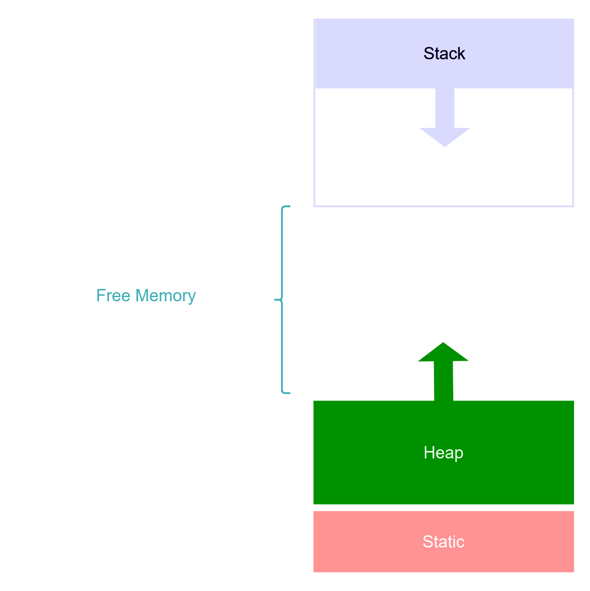

# Virtual Memory Layout

## คำอธิบายเกี่ยวกับ Memory Layout

ในระบบคอมพิวเตอร์ การจัดการหน่วยความจำถูกแบ่งออกเป็นส่วนต่างๆ ที่มีหน้าที่และคุณสมบัติที่แตกต่างกัน โดยทั่วไปแบ่งออกเป็นสามส่วนหลักคือ **Stack**, **Heap**, และ **Static** ซึ่งแต่ละส่วนมีลักษณะเฉพาะตัวดังนี้:

### Stack

- **Content**:
  - Function arguments
  - Local variables ที่รู้ขนาดตั้งแต่ช่วงที่ compile
- **Size**:
  - ขนาดไดนามิก แต่มีขีดจำกัดที่ตั้งไว้
- **Lifetime**:
  - ตามอายุของฟังก์ชันที่สร้างขึ้น

**Stack** ถูกใช้เพื่อจัดเก็บข้อมูลที่มีขนาดคงที่และมีอายุการใช้งานสั้น เช่น ตัวแปรภายในฟังก์ชัน ซึ่งข้อมูลบน stack จะถูกจัดเก็บและลบออกอย่างเป็นระบบตามลำดับการเรียกใช้งานฟังก์ชัน

### Heap

- **Content**:
  - ข้อมูลที่มีขนาดใหญ่
  - ข้อมูลที่ไม่รู้ขนาดในช่วงที่ compile
  - ข้อมูลที่จะต้องมีอายุอยู่นานกว่าอายุของฟังก์ชัน
- **Size**:
  - ขนาดไดนามิก ไม่มีขีดจำกัด
- **Lifetime**:
  - แต่ละภาษาจัดการไม่เหมือนกัน

**Heap** ใช้สำหรับจัดเก็บข้อมูลที่มีขนาดใหญ่หรือข้อมูลที่ขนาดไม่สามารถระบุได้ในขณะ compile โดยข้อมูลบน heap จะมีอายุการใช้งานยาวนานกว่า stack และการจัดการหน่วยความจำบน heap มักจะต้องมีการจัดการด้วยตนเองหรือผ่าน garbage collector ขึ้นอยู่กับภาษาโปรแกรมที่ใช้งาน

### Static

- **Content**:
  - ตัวแปรแบบ static
  - string literals
  - ไบนารี
- **Size**:
  - ขนาดคงที่
- **Lifetime**:
  - ตลอดอายุของโปรเซส หากโปรเซสถูกยุติ ข้อมูลก็จะถูกลบออกด้วย

ส่วน **Static** ใช้สำหรับจัดเก็บข้อมูลที่ต้องการอยู่ตลอดอายุของโปรเซส เช่น ตัวแปรคงที่ที่ไม่เปลี่ยนแปลงระหว่างการทำงานของโปรแกรม ข้อมูลเหล่านี้จะถูกจัดเก็บในพื้นที่หน่วยความจำแบบ static และไม่ถูกลบออกจนกว่าโปรเซสจะสิ้นสุด