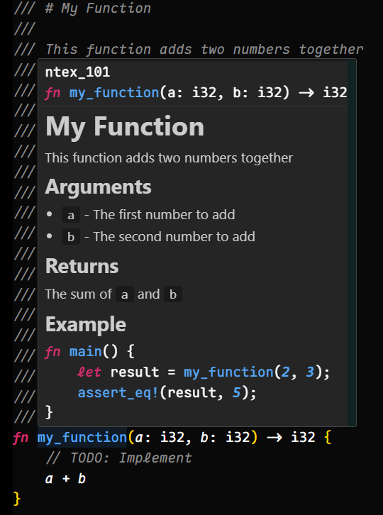

# Inline Documentation

> [!NOTE]
> Rust มีการสนับสนุนการเขียน `Inline Documentation` หรือ `Inline Doc` อย่างมีประสิทธิภาพ
> ซึ่งเราสามารถเขียน `Inline Doc` ได้ผ่านการใส่ Comment `///` แบบนี้ในรูปแบบของ
> `Markdown syntax` ได้

> [!TIP]
>
> - Rust สามารถตรวจสอบความถูกต้องของ `Inline Doc` รวมถึงสามารถเขียน Test ภายใน
>   `Inline Doc` ได้อีกด้วย โดยสามารถตรวจสอบได้ผ่านการรัน `cargo test`
>   เราจึงสามารถมั่นใจได้ว่า `Inline Doc` ที่เราเขียนนั้นถูกต้องและสามารถใช้ได้จริง
> - ด้วยเหตุนี้ Library ส่วนใหญ่ของ Rust จึงมี `Inline Doc` ที่มีประสิทธิภาพ
>   และเพิ่มความสะดวกในการใช้งานอย่างมาก

## Example

เขียน `Inline Doc` ด้วย `///`

````rust
fn main() {
    my_function();
}

/// # My Function
///
/// This function adds two numbers together
///
/// ## Arguments
///
/// * `a` - The first number to add
/// * `b` - The second number to add
///
/// ## Returns
///
/// The sum of `a` and `b`
///
/// ## Example
///
/// ```rust
/// fn main() {
///     let result = my_function(2, 3);
///     assert_eq!(result, 5);
/// }
/// ```
fn my_function(a: i32, b: i32) -> i32 {
    // TODO: Implement
    a + b
}
````

ผลลัพธ์๋ที่ได้


