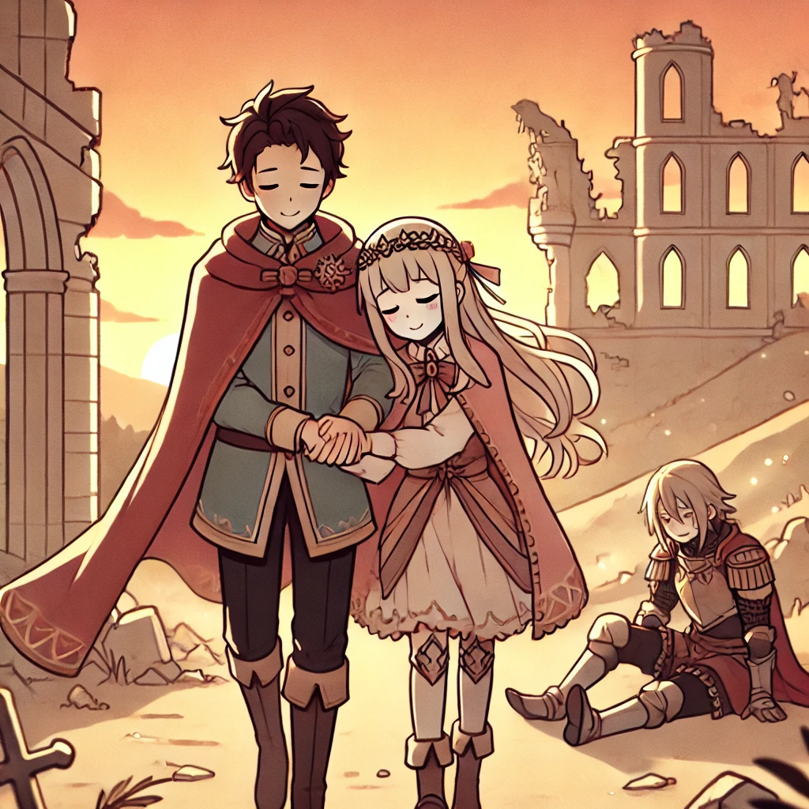

# บทที่ 5: การเผชิญหน้าครั้งสุดท้าย

<div>
  <audio controls loop autoplay>
    <source src="../audio/chap5.mp3" type="audio/mpeg">
    เบราว์เซอร์ของคุณไม่รองรับการเล่นเสียง
  </audio>
</div>

> "ในที่สุดวันนี้ก็มาถึง... วันที่ข้าต้องเผชิญหน้ากับจอมมาร การต่อสู้ครั้งนี้จะไม่มีโอกาสให้ผิดพลาด ทุกการตัดสินใจ ทุกการเคลื่อนไหว ต้องสมบูรณ์แบบ"


****
> [!Note]
> Error handling    
> การจัดการข้อผิดพลาด คือวิธีการรับมือกับสถานการณ์ที่โปรแกรมอาจทำงานผิดพลาด เช่น ถ้าโปรแกรมอ่านไฟล์ไม่สำเร็จแล้วพยายามใช้ข้อมูลที่อ่านไม่ได้นั้นต่อ มันก็จะเกิดปัญหาแน่นอน การที่เราสังเกตและจัดการกับข้อผิดพลาดอย่างชัดเจน จะช่วยป้องกันปัญหาต่างๆ ที่อาจเกิดขึ้นในโปรแกรม
> ในภาษา Rust มีวิธีจัดการข้อผิดพลาด 3 แบบหลักๆ:
> - `panic` - ใช้เมื่อเจอข้อผิดพลาดร้ายแรงที่แก้ไขไม่ได้
>   - เหมาะสำหรับการเขียน Test
>   - ใช้ตอนทำต้นแบบโปรแกรม (prototype)
> - `Option` - ใช้เมื่อค่าอาจมีหรือไม่มีก็ได้
>   - `unwrap` ใช้ได้เมื่อแน่ใจ 100% ว่าต้องมีค่า
>   - `expect` แนะนำให้ใช้ expect ดีกว่าเพราะระบุข้อความแจ้งเตือนได้
> - `Result` - ใช้เมื่อการทำงานอาจล้มเหลวและต้องให้ผู้เรียกจัดการปัญหา
>   - เหมาะกับงานที่มีโอกาสผิดพลาดสูง
>   - ไม่ควรใช้ unwrap/expect ยกเว้นตอน Test หรือทำ prototype
> 
> สรุปง่ายๆ:
> - ถ้าแก้ไขไม่ได้เลย -> ใช้ `panic`
> - ถ้าอาจมีหรือไม่มีค่า -> ใช้ `Option`
> - ถ้ามีโอกาสผิดพลาดและต้องจัดการ -> ใช้ `Result`
> 
****

## การรับมือกับความล้มเหลว (Result)

```rust, editable
#[derive(Debug)]
enum BattleError {
    OutOfMana(u32),  
    WeaponBroke,     
    TooExhausted,     
}

fn strike_demon_lord(power: u32, mana: u32) -> Result<String, BattleError> {
    if mana < 50 {
        return Err(BattleError::OutOfMana(50 - mana));
    }

    match power {
        0..=100 => Err(BattleError::TooExhausted),
        101..=500 => Ok("Attack successful! Demon lord is injured".to_string()),
        _ => Ok("Explosion! Demon lord is severely injured!!".to_string())
    }
}

fn main() {
    let result = strike_demon_lord(100, 40);
    match result {
        Ok(msg) => println!("{}", msg),
        Err(e) => println!("Failed: {:?}", e)
    }
}
```

## การไม่ยอมแพ้ต่อโชคชะตา (Option)

```rust, editable
#[allow(dead_code)]
fn find_princess(castle_level: u32) -> Option<String> {
    match castle_level {
        7 => Some("Found princess! She is in the top room".to_string()),
        _ => None
    }
}

fn main() {
    // ทดสอบ unwrap() - จะทำงานได้เพราะ level = 7
    let result1 = find_princess(7).unwrap();
    println!("{}", result1);

    // ทดสอบ expect() - จะ panic พร้อมข้อความที่กำหนด
    let result2 = find_princess(1)
        .expect("Error: Princess not found");
    println!("{}", result2);
}
```

## การต่อสู้ครั้งสุดท้าย (Final Battle)

```rust, editable
#[derive(Debug)]
enum DemonLordAttack {
    DarkDestruction,
    SoulDrain,
    EndOfWorld,
}

fn face_demon_lord(
    hero_power: u32,
    hero_mana: u32,
    princess_rescued: bool
) -> Result<String, String> {
    if !princess_rescued {
        return Err("Not found! Must rescue princess first!".to_string());
    }

    if hero_mana == 0 {
        return Err("Out of mana... everything is over".to_string());
    }

    match hero_power {
        power if power > 1000 => Ok("Victory! Demon lord is defeated!".to_string()),
        power if power > 500 => Ok("We did it! Even though severely injured...".to_string()),
        _ => Err("Not enough power... but I won't give up!".to_string())
    }
}

fn main() {
    let result = face_demon_lord(100, 40, true);
    match result {
        Ok(msg) => println!("{}", msg),
        Err(e) => println!("Failed: {}", e)
    }
}
```

## แบบฝึกหัดการต่อสู้ครั้งสุดท้าย:
---
### บททดสอบการกล้าเผชิญหน้า
ให้เติม syntax ที่ถูกต้องลงในช่องว่าง
```rust, editable
fn challenge_demon_lord(power: u32) -> Result<String, String> {
    match power {
        0..=100 => ____("Not enough power... I won't give up!".to_string()), //should be Error
        101..=500 => Ok("I will defeat you!".to_string()),
        _ => Ok("I will defeat you!".to_string())
    }
}

fn main() {
    match challenge_demon_lord(100) {
        ____ => println!("{}", msg),
        ____ => println!("Failed: {}", e)
    }
}
```

### บททดสอบการช่วยเหลือเจ้าหญิง
ให้เติม syntax ที่ถูกต้องลงในช่องว่าง
```rust, editable
#[derive(Debug)]
enum RescueError {
    GuardTooStrong,
    WrongLocation,
    TrappedInside,
}

fn rescue_princess(
    location: u32
) -> Result<String, RescueError> {
    match location {
        7 => Ok("Found princess! She is in the top room".to_string()),
        _ => ____(RescueError::WrongLocation)
    }
}
    
fn main() {
    let result = rescue_princess(1);
    match result {
        ____ => println!("{}", msg),
        ____ => println!("Failed: {:?}", e)
    }
}
```

### บททดสอบการต่อสู้ครั้งสุดท้าย
ให้เติม syntax ที่ถูกต้องลงในช่องว่าง
```rust, editable
struct Hero {
    power: u32,
    mana: u32,
    courage: u32,
}

fn final_battle(hero: Hero) -> Result<String, String> {
    if hero.courage < 100 {
        return ____("Fear is overwhelming...".to_string());
    }
    
    match (hero.power, hero.mana) {
        (p, m) if p > 1000 && m > 500 => Ok("Victory! Demon lord is defeated!".to_string()),
        (p, _) if p > 750 => Ok("We did it! Even though severely injured...".to_string()),
        (_, m) if m > 1000 => Ok("Not enough power... but I won't give up!".to_string()),
        _ => ____("There is no way... this is the end of my power".to_string())
    }
}

fn main() {
    let result = final_battle(Hero { power: 1000, mana: 500, courage: 100 });
    match result {
        ____ => println!("{}", msg),
        ____ => println!("Failed: {}", e)
    }
}
```

> "ในที่สุดทุกอย่างก็จบลง... จอมมารพ่ายแพ้ เจ้าหญิงได้รับการช่วยเหลือ และข้า - ชาวบ้านธรรมดาที่ไม่เคยคิดว่าตัวเองจะทำได้ ได้พิสูจน์ให้เห็นว่าแม้แต่คนธรรมดาก็สามารถเอาชนะโชคชะตาได้ ถ้ามีความมุ่งมั่นและไม่ยอมแพ้..."

> "การผจญภัยครั้งนี้สอนให้ข้ารู้ว่า ไม่มีความล้มเหลวใดที่จะหยุดยั้งผู้ที่ไม่ยอมแพ้ได้ แม้จะเป็นเพียงคนธรรมดา แต่หัวใจที่กล้าหาญและความมุ่งมั่นที่จะเอาชนะข้อจำกัดของตัวเอง คือพลังที่ยิ่งใหญ่ที่สุด..."



จบบริบูรณ์.
