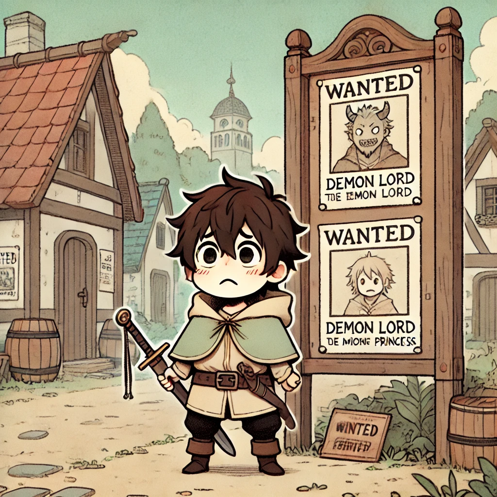
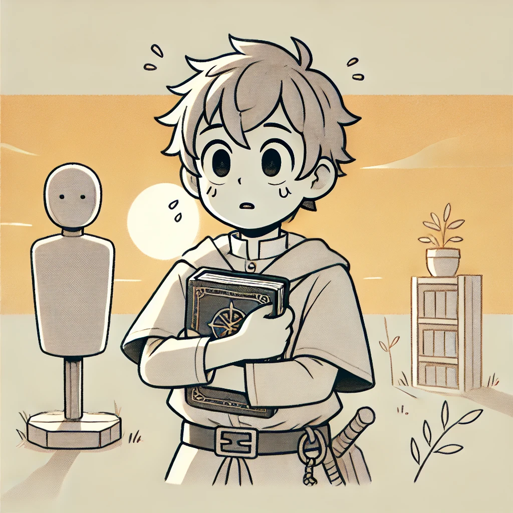

# บทที่ 1: การตัดสินใจของคนธรรมดา

<div>
  <audio controls loop autoplay>
    <source src="../audio/chap1.mp3" type="audio/mpeg">
    เบราว์เซอร์ของคุณไม่รองรับการเล่นเสียง
  </audio>
</div>

> โลกใบนี้ถูกปกคลุมด้วยความมืดมิด หลังจากจอมมารสังหารผู้กล้าและลักพาตัวเจ้าหญิงไป ทุกหนแห่งเต็มไปด้วยความหวาดกลัว แต่ข้าไม่คิดจะยอมแพ้ แม้จะเป็นเพียงชาวบ้านธรรมดาที่ไร้พรสวรรค์ ข้าก็จะเป็นผู้ที่กำราบจอมมารและช่วยเหลือเจ้าหญิงให้ได้ ตอนนี้ในใจมีเพียงคำถามเดียว: จะยอมจำนนต่อโชคชะตา หรือจะลุกขึ้นสู้?



## การตัดสินใจครั้งแรกด้วย `if-else`
****
> [!NOTE]
> การแตกกิ่งด้วย `if-else` ในภาษา Rust คล้ายกับภาษาอื่นๆ แต่มีข้อแตกต่างคือ เงื่อนไข Boolean ไม่จำเป็นต้องอยู่ในวงเล็บ และแต่ละเงื่อนไขจะตามด้วยบล็อกของโค้ด นอกจากนี้ `if-else` ยังเป็น expression ที่ทุกกิ่งต้องส่งค่ากลับเป็นชนิดเดียวกัน
>

```rust, editable
fn main() {
    let my_strength = 5;     
    let demon_power = 100; 
    
    if my_strength > demon_power {
        println!("This is impossible... I'm too weak");
    } else {
        println!("Even though I'm weak... I won't give up!");
    }
}
```

## จุดเริ่มต้นของการต่อต้านด้วย `if let`
****
> [!NOTE]
> ในบางกรณีการใช้ `match` เพื่อตรวจสอบค่าใน enum อาจจะเขียนยาวเกินไป `if let` จึงเป็นทางเลือกที่ช่วยให้เขียนโค้ดได้กระชับและอ่านง่ายขึ้น
>
```rust, editable
fn main() {
    let ancient_book: Option<&str> = Some("The Forbidden Scroll");

    if let Some(book) = ancient_book {
        println!("'{}'... The only way the commoner can fight the demon lord", book);
    } else {
        println!("There's no way out anymore...");
    }
}
```

### ตัวอย่างการโค้ดเดิมที่ใช้ match 
```rust, editable
fn main() {
    let ancient_book: Option<&str> = Some("The Forbidden Scroll");

    match ancient_book {
        Some(book) => println!("'{}'... The only way the commoner can fight the demon lord", book),
        None => println!("There's no way out anymore..."),
    }
}
```

> [!NOTE]
> `if let` สามารถใช้กับ enum ได้เช่นกัน ทำให้การตรวจสอบค่าใน enum ทำได้ง่ายและกระชับขึ้น
>

```rust, editable
enum Hero {
    Novice(u32),      
    Specialist(String),  
    Legendary,
}

fn main() {
    let hero = Hero::Novice(5);
    
    // ใช้ match
    match hero {
        Hero::Novice(power) => println!("Novice Hero, Power: {}", power),
        Hero::Specialist(weapon) => println!("Specialist Hero, Weapon: {}", weapon),
        Hero::Legendary => println!("Legendary Hero"),
    }
    
    // ใช้ if let ที่กระชับกว่า
    if let Hero::Novice(power) = hero {
        println!("Novice Hero, Power: {}", power);
    }
    
    // ตัวอย่างเพิ่มเติม
    let legendary = Hero::Legendary;
    if let Hero::Legendary = legendary {
        println!("Hero in the legend has appeared!");
    }
}
```

## แบบฝึกหัดแห่งการเริ่มต้น:
---
### บททดสอบความกล้าหาญ
ให้เติม syntax ที่ถูกต้องลงในช่องว่าง
```rust, editable
fn main() {
    let fear_level = 10; 

    ____ fear_level > 7 {
        println!("Fear is overwhelming...");
    } ____ fear_level > 3 {
        println!("I must overcome my fear!");
    } ____ {
        println!("I'm not afraid! I'm ready to face the demon lord!");
    }
}
```

### บททดสอบการค้นพบ
ให้เติม syntax ที่ถูกต้องลงในช่องว่าง
```rust, editable
fn main() {
    let forbidden_scroll: Option<&str> = Some("The Way to Defeat the Demon Lord");

    if let ____ = forbidden_scroll {
        println!("Found hope in the scroll: {}", scroll);
    } else {
        println!("The scroll is empty... hope is still lost");
    }
}
```

### บททดสอบการเลือกเส้นทาง
ให้เติม syntax ที่ถูกต้องลงในช่องว่าง
```rust, editable
enum Path {
    Fight(u8),   
    Hide,         
    Surrender,   
}

fn main() {
    let chosen_path = Path::Fight(9);
    
    if let Path::Fight(risk_level) = ____ {
        if ____ > 8 {
            println!("This path is too risky... but it's the only way");
        } else {
            println!("Risk level: {} - Still hopeful", ____);
        }
    } else if let Path::Hide = chosen_path {
        println!("Hiding is not an option... the princess is waiting");
    } else {
        println!("Giving up is a disservice to everyone's hope");
    }
}
```

> "แม้จะเป็นเพียงคนธรรมดา แต่ข้าจะพิสูจน์ว่าโชคชะตาไม่ใช่สิ่งที่กำหนดไว้ตายตัว... ข้าจะต้องแข็งแกร่งขึ้น และเพื่อให้ทำเช่นนั้นได้ ข้าต้องฝึกฝนอย่างไม่มีที่สิ้นสุด..."



ติดตามการผจญภัยต่อใน [บทที่ 2: วงจรแห่งการฝึกฝน](./loop.md) ที่จะเผยถึงวิธีที่คนธรรมดาจะก้าวข้ามขีดจำกัดของตัวเอง...
