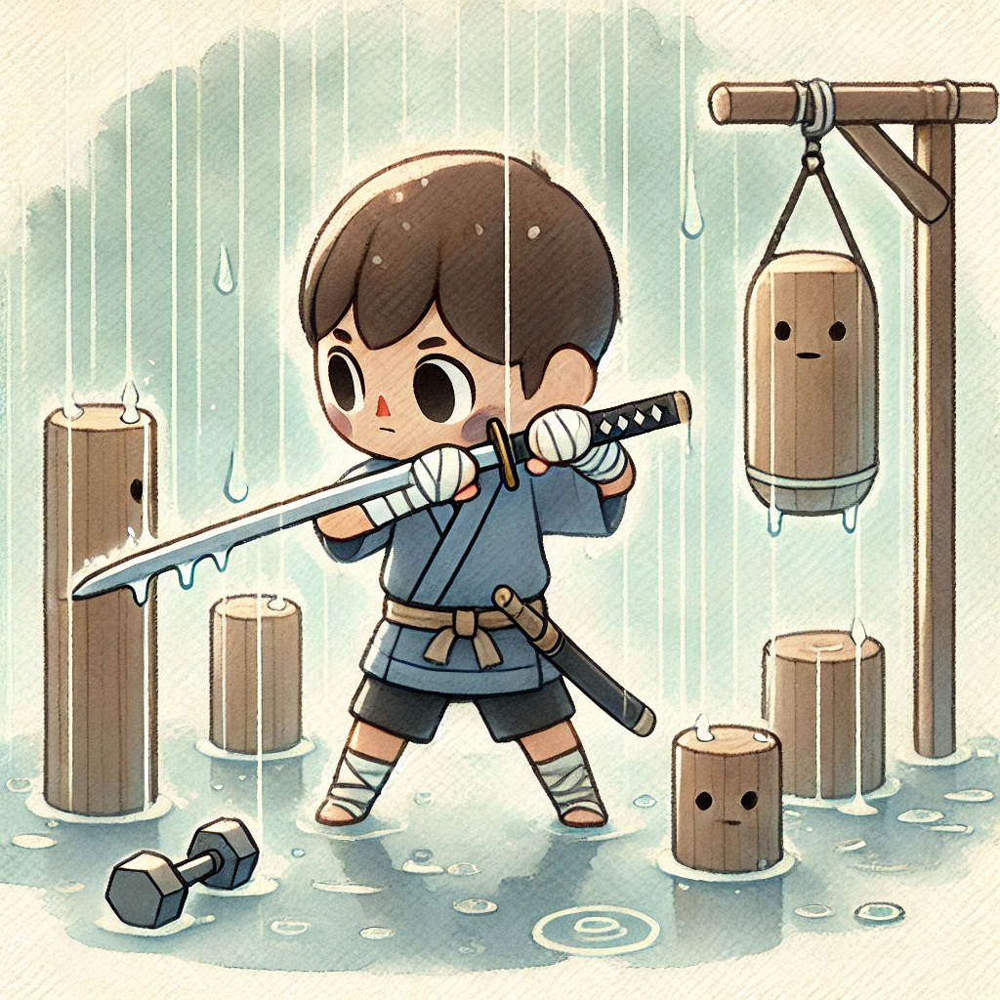
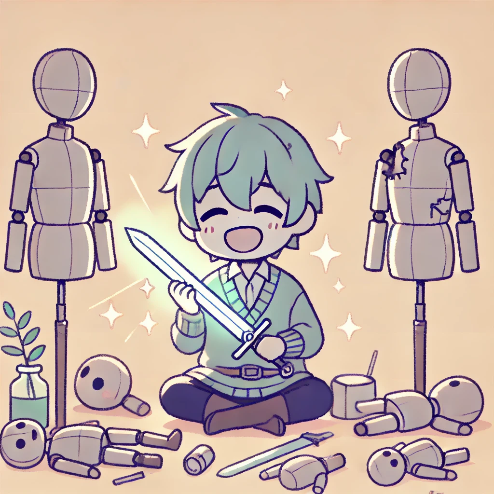

# บทที่ 2: วงจรแห่งการฝึกฝน

<div>
  <audio controls loop autoplay>
    <source src="../audio/chap2.mp3" type="audio/mpeg">
    เบราว์เซอร์ของคุณไม่รองรับการเล่นเสียง
  </audio>
</div>

> "การเป็นคนธรรมดาไม่ใช่ข้อจำกัด แต่เป็นแรงผลักดัน... ข้าจะฝึกฝนจนกว่าร่างกายจะพัง จะล้มแล้วลุกอีกครั้ง จนกว่าจะแข็งแกร่งพอที่จะต่อกรกับจอมมาร"



## การฝึกฝนไม่มีที่สิ้นสุด (loop)
****
> [!NOTE]
> `loop` เป็นคำสั่งที่ทำให้การทำงานวนซ้ำไม่มีที่สิ้นสุด จนกว่าจะมีคำสั่ง `break` หรือมีข้อยกเว้นอื่นๆ เช่น `return` หรือ `panic!` เพื่อหยุดการทำงาน
>

```rust, editable
fn main() {
    let mut training_days = 0;
    let mut strength = 1;
    
    loop {
        println!("Day {}: Training until exhaustion...", training_days);
        training_days += 1;
        strength += 1;
        
        if strength >= 100 {
            println!("After {} days, I'm finally strong enough", training_days);
            break;
        }
    }
}
```

## การฝึกทักษะหลายด้าน (for)
****
> [!NOTE]
> `for` ใช้สำหรับการวนซ้ำผ่านข้อมูลที่เป็น Iterator เช่น Range, Array, Vector หรือ Collection อื่นๆ โดยจะทำงานจนกว่าจะครบทุกรายการ หรือมีคำสั่ง break เพื่อหยุดการทำงาน
>

```rust, editable
fn main() {
    let skills = vec!["Sword", "Bow", "Magic", "Fighting"];
    
    // วนลูปผ่าน Vector
    for skill in skills {
        println!("Training skill: {}", skill);
    }
    
    // วนลูปผ่าน Range
    for i in 0..3 {
        println!("Training round: {}", i + 1);
    }
}
```
> [!TIP]
> `iter` - เป็นการยืมข้อมูลแต่ละตัวมาใช้ในการวนลูป โดยไม่มีผลกระทบต่อข้อมูลต้นฉบับ ทำให้สามารถนำข้อมูลกลับมาใช้ซ้ำได้หลังจากลูปเสร็จ
>
> `into_iter` - เป็นการนำข้อมูลมาใช้แบบใช้แล้วหมดไป เมื่อวนลูปเสร็จจะไม่สามารถนำข้อมูลกลับมาใช้ได้อีก เพราะข้อมูลถูก 'ย้าย' ไปใช้ได้ในลูปแล้ว
>
> `iter_mut` - เป็นการยืมข้อมูลแบบแก้ไขได้ ทำให้สามารถเปลี่ยนแปลงค่าของข้อมูลภายในลูปได้
>

```rust, editable
fn main() {
    let mut skills = vec![
        String::from("Sword"),
        String::from("Bow"),
        String::from("Magic"),
        String::from("Fighting"),
    ];

    for skill in skills.iter() {
        println!("Training skill: {}", skill);
    }

    for skill in skills.iter_mut() {
        *skill = skill.to_uppercase();
        println!("Training skill: {}", skill);
    }

    for skill in skills.into_iter() {
        println!("Training skill: {}", skill);
    }
}
```


## การฝึกจนกว่าจะสำเร็จ (while)
****

> [!NOTE]
> `while` ใช้สำหรับการวนซ้ำจนกว่าจะเกิดเหตุการณ์ที่ต้องการ เช่น การตรวจสอบความสำเร็จหรือการตรวจสอบสถานะของตัวแปรใดๆ จนกว่าจะสำเร็จ
>

```rust, editable
fn main() {
    let mut success_rate = 0;
    
    while success_rate < 100 {
        println!("Success rate: {}% - Not enough... keep training", success_rate);
        success_rate += 10;
    }
}
```

## การเรียนรู้คัมภีร์โบราณ (while let)
****

> [!NOTE]
> เช่นเดียวกับ `if let`, `while let` สามารถทำให้การเขียนลำดับของ `match` ที่ดูยุ่งยากให้เขียนได้ง่ายขึ้น
>

```rust, editable
fn main() {
    let mut ancient_techniques: Vec<Option<&str>> = vec![
        Some("Sword Mastery"),
        Some("Fighting Art"), 
        Some("Spell of Annihilation"),
    ];
    
    while let Some(Some(technique)) = ancient_techniques.pop() {
        println!("Learning {}: One step closer to defeating the demon lord", technique);
    }
}
```
> [!TIP]
> การใช้ Some ซ้อนกัน 2 ชั้นในที่นี้มีเหตุผลดังนี้:
> 1. Some ชั้นแรก มาจากการที่ `pop()` จะคืนค่าเป็น `Option` เสมอ (Some เมื่อมีข้อมูล, None เมื่อ vector ว่างเปล่า)
> 2. Some ชั้นที่สอง คือตัวข้อมูลในแต่ละช่องของ vector ที่เราประกาศเป็น `Option<&str>`
>

## แบบฝึกหัดการฝึกฝน:
---
### บททดสอบความอดทน
ให้เติม syntax ที่ถูกต้องลงในช่องว่าง
```rust, editable
fn main() {
    // เติมการฝึกซ้ำๆ จนกว่าจะครบ 100 ครั้ง
    for count in ____ {
        println!("Training sword: {}", count);
    }
}
```

### บททดสอบการฝึกต่อเนื่อง
ให้เติม syntax ที่ถูกต้องลงในช่องว่าง
```rust, editable
fn main() {
    let mut stamina = 100;
    
    ____ stamina > 0 {
        println!("Stamina: {}", stamina);
        stamina -= 10;
        
        if stamina <= 0 {
            println!("Exhausted... but I must keep fighting");
            ____;
        }
    }
}
```

### บททดสอบการเอาชนะขีดจำกัด
ให้เติม syntax ที่ถูกต้องลงในช่องว่าง
```rust, editable
fn training_to_surpass_limits(days: u32) -> (u32, u32) {
    let mut power = 1;
    let mut knowledge = 0;
    
    for day in 1..=days {
        ____ {
            if power >= 1000 {
                println!("Day {}: Overcome human limits", day);
                ____;
            }
            
            power *= 2;
            knowledge += 1;
            
            if knowledge % 10 == 0 {
                println!("Learning new secrets!");
            }
        }
    }
    
    (power, knowledge)
}

fn main() {
    let (final_power, total_knowledge) = training_to_surpass_limits(30);
    println!("Power: {} | Knowledge: {}", final_power, total_knowledge);
}
```

>"ทุกหยดเหงื่อ ทุกหยดเลือด ล้วนนำข้าเข้าใกล้เป้าหมายมากขึ้น... แต่การฝึกฝนอย่างเดียวไม่พอ ข้าต้องเรียนรู้ที่จะเผชิญหน้ากับศัตรูที่แข็งแกร่งกว่า..."



ติดตามการผจญภัยต่อใน [บทที่ 3: การเผชิญหน้ากับศัตรู](./match.md) ที่จะเผยถึงวิธีการรับมือกับภัยคุกคามที่หลากหลาย...
