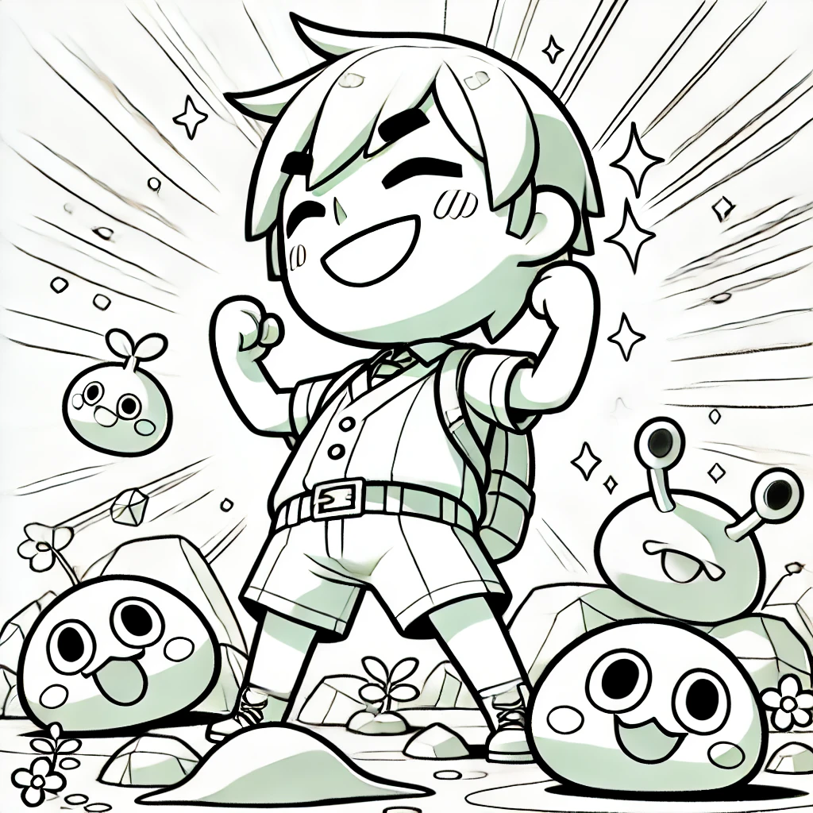

# บทที่ 3: การเผชิญหน้ากับศัตรู

<div>
  <audio controls loop autoplay>
    <source src="../audio/chap3.mp3" type="audio/mpeg">
    เบราว์เซอร์ของคุณไม่รองรับการเล่นเสียง
  </audio>
</div>

> "หลังจากฝึกฝนมาอย่างหนัก ข้าได้เรียนรู้ว่าศัตรูมีหลากหลายรูปแบบ... การจะเอาชนะจอมมารได้ ข้าต้องเรียนรู้ที่จะรับมือกับทุกสถานการณ์"


## การวิเคราะห์คู่ต่อสู้ (Pattern Matching)
****
> [!NOTE]
> Rust มีการจับคู่รูปแบบผ่านคีย์เวิร์ด `match` ซึ่งใช้งานคล้ายกับ switch ใน C หรือ JavaScript โดยจะประเมินกิ่งแรกที่ตรงกับรูปแบบ และต้องครอบคลุมทุกค่าที่เป็นไปได้
>

```rust, editable
enum Enemy {
    Goblin(u32),      
    DarkKnight(u32), 
    Dragon(u32, u32),
    DemonLord,       
}

fn analyze_enemy(enemy: Enemy) -> String {
    match enemy {
        Enemy::Goblin(attack) => {
            format!("Just a common goblin. Attack power: {}", attack)
        }
        Enemy::DarkKnight(defense) => {
            format!("Dark knight. Defense power: {}", defense)
        }
        Enemy::Dragon(attack, defense) => {
            format!("Dragon! Attack power: {}, Defense power: {}", attack, defense)
        }
        Enemy::DemonLord => String::from("Demon lord... the true enemy")
    }
}

fn main() {
    let enemy = Enemy::Dragon(100, 50);
    println!("{}", analyze_enemy(enemy));
}
```

> [!TIP]
> `format!()` เป็นฟังก์ชันที่ใช้สำหรับการจัดรูปแบบข้อความ ซึ่งจะส่งคืน String ที่จัดรูปแบบแล้ว โดยสามารถรวมตัวแปรหรือค่าต่างๆ ได้อย่างง่ายดาย
>


## การเลือกอาวุธ (Weapon Selection)

```rust, editable
enum Weapon {
    Sword(u32),
    Bow(u32, u32),  
    Magic(String),
    None,
}

fn choose_weapon(weapon: &Weapon) -> &str {
    match weapon {
        Weapon::Sword(power) if *power > 100 => "Sword Mastery!",
        Weapon::Sword(_) => "Basic Sword",
        Weapon::Bow(power, range) if *power > 50 && *range > 100 => "Bow of Light!",
        Weapon::Bow(_, _) => "Wooden Bow",
        Weapon::Magic(spell) => {
            match spell.as_str() {
                "fire" => "Fire Magic",
                "ice" => "Ice Magic",
                _ => "Basic Magic"
            }
        }
        Weapon::None => "No weapon... must fight with bare hands"
    }
}

fn main() {
    let weapon = Weapon::Magic(String::from("fire"));
    println!("{}", choose_weapon(&weapon));
}
```

## แบบฝึกหัดการต่อสู้:
---
### บททดสอบการวิเคราะห์ศัตรู
ให้เติม syntax ที่ถูกต้องลงในช่องว่าง
```rust, editable
enum Monster {
    Slime(u32),   
    Wolf(bool),     
    Undead(String), 
}

fn analyze_monster(monster: Monster) -> String {
    ____ monster {
        Monster::____ => format!("Size of it: {}", size),
        Monster::____ => {
            if is_strong {
                format!("Strong wolf")
            } else {
                format!("Basic wolf")
            }
        }
        Monster::____ => format!("Type of it: {}", type_),
    }
}

fn main() {
    let monster = Monster::Wolf(true);
    println!("{}", analyze_monster(monster));
}
```

### บททดสอบการประเมินสถานการณ์
ให้เติม syntax ที่ถูกต้องลงในช่องว่าง
```rust, editable
enum Situation {
    Ambush(u32),          
    Trap(String, bool),   
    Boss(u32, u32, u32),   
}

fn evaluate_situation(situation: Situation) -> String {
    ____ situation {
        Situation::____ if count > 10 => format!("There are many enemies in this area"),
        Situation::Ambush(_) => format!("There are enemies in this area"),
        Situation::Trap(trap_type, triggered) => format!("There is a {} trap in this area", trap_type),
        Situation::____ => format!("The enemy is a demon lord with attack {}, defense {}, and health {}", atk, def, hp),
    }
}

fn main() {
    let situation = Situation::Boss(100, 50, 1000);
    println!("{}", evaluate_situation(situation));
}
```

### บททดสอบการต่อสู้กับจอมมาร
ให้เติม syntax ที่ถูกต้องลงในช่องว่าง
```rust, editable
enum DemonLordPhase {
    Phase1(u32),         
    Phase2(u32, String), 
    FinalPhase(bool),    
}

fn battle_demon_lord(phase: DemonLordPhase, hero_power: u32) -> Result<String, String> {
    ____ phase {
        DemonLordPhase::Phase1(power) if hero_power > power => Ok("Demon lord's power is not that strong...".to_string()),
        DemonLordPhase::Phase1(_) => Err("Demon lord's power is not that strong...".to_string()),
        DemonLordPhase::Phase2(power, ultimate) => {
            ____ ultimate.as_str() {
                "DarkDestruction" if hero_power > power * 2 => Ok("Demon lord's power is not that strong...".to_string()),
                _ => Err("Demon lord's power is not that strong...".to_string()),
            }
        }
        DemonLordPhase::____ => {
            if all_out {
                Ok("Demon lord used all his power...".to_string())
            } else {
                Err("Demon lord still has power...".to_string())
            }
        }
    }
}

fn main() {
    let phase = DemonLordPhase::FinalPhase(true);
    println!("{}", battle_demon_lord(phase, 100).unwrap());
}
```

> "การเผชิญหน้ากับศัตรูทำให้ข้าเข้าใจว่า... การมีพลังอย่างเดียวไม่พอ ข้าต้องรู้จักใช้สติปัญญาและกลยุทธ์ในการต่อสู้ด้วย..."



ติดตามการผจญภัยต่อใน [บทที่ 4: การร่ายคาถา](./function.md) ที่จะเผยถึงวิธีการใช้พลังพิเศษผ่านการเขียนฟังก์ชัน...
